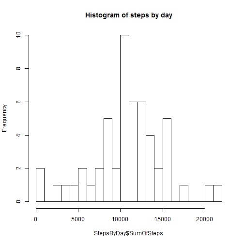
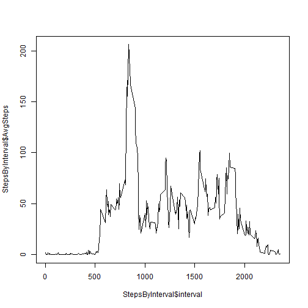
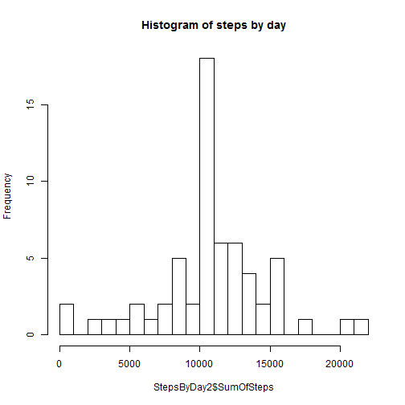
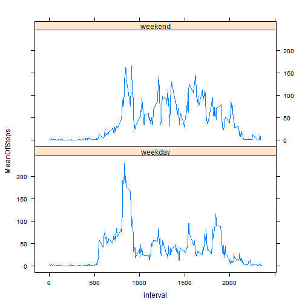

This document is created to report works on assignment 1 for course "Reproducible research"


###Loading packages and data (including records with NA)


```r
library(ggplot2)
library(plyr)
library(lattice)
url<-"activity.csv"
data0<-read.csv(url, header = TRUE, sep=",")
head(data0)
```

```
##   steps       date interval
## 1    NA 2012-10-01        0
## 2    NA 2012-10-01        5
## 3    NA 2012-10-01       10
## 4    NA 2012-10-01       15
## 5    NA 2012-10-01       20
## 6    NA 2012-10-01       25
```

###Removing NAs 


```r
dataValid<-data0[!is.na(data0$steps),]
head(dataValid)
```

```
##     steps       date interval
## 289     0 2012-10-02        0
## 290     0 2012-10-02        5
## 291     0 2012-10-02       10
## 292     0 2012-10-02       15
## 293     0 2012-10-02       20
## 294     0 2012-10-02       25
```

###Calculating the total number of steps taken by day

```r
StepsByDay<-ddply(dataValid,"date",summarise, SumOfSteps=sum(steps))
hist(StepsByDay$SumOfSteps,20,main="Histogram of steps by day")
```

 

Basic statistics:

```r
summary(StepsByDay$SumOfSteps)
```

```
##    Min. 1st Qu.  Median    Mean 3rd Qu.    Max. 
##      41    8841   10760   10770   13290   21190
```

###Daily activity pattern


```r
StepsByInterval<-ddply(dataValid,"interval",summarise, AvgSteps=mean(steps))
plot(StepsByInterval$interval, StepsByInterval$AvgSteps, type="l")
```

 

Finding interval with maximum average number of steps:

```r
maxInterval<-StepsByInterval$interval[StepsByInterval$AvgSteps==max(StepsByInterval$AvgSteps)]
```

Interval with maximum average number of steps: 835

### Imputing missing values


```r
stepsNA<-nrow(data0[is.na(data0$steps),])
dateNA<-nrow(data0[is.na(data0$date),])
intervalNA<-nrow(data0[is.na(data0$interval),])
```

Number of NAs in the data set: 2304 for variable 'steps', 0 for variable 'date', 0 for variable 'interval

Only variable 'steps' needs any dealing with NAs.
Missing values will be replaced with the average for the same interval.


```r
dataNAS<-data0[is.na(data0$steps),]
dataNAS<-join(dataNAS,StepsByInterval)
```

```
## Joining by: interval
```

```r
dataNAS$steps<-dataNAS$AvgSteps
dataCleared<-join(dataNAS,dataValid, type="full")
```

```
## Joining by: steps, date, interval
```


Calculating the total number of steps taken by day - for imputed NAs

```r
StepsByDay2<-ddply(dataCleared,"date",summarise, SumOfSteps=sum(steps))
hist(StepsByDay2$SumOfSteps,20,main="Histogram of steps by day")
```

 

Basic statistics:

```r
summary(StepsByDay2$SumOfSteps)
```

```
##    Min. 1st Qu.  Median    Mean 3rd Qu.    Max. 
##      41    9819   10770   10770   12810   21190
```

Only slight differences in distribution of 'steps' by interval, a bit more concentrated around dominant value

### Differences in activity patterns between weekdays and weekends


```r
dataCleared$date<-as.Date(dataCleared$date)
dataCleared$weekday<-weekdays(dataCleared$date, abbreviate = TRUE)
dataCleared$weekday2<-"weekday"
dataCleared$weekday2[dataCleared$weekday=="So"|dataCleared$weekday=="N"]<-"weekend"
StepsByWeekday<-ddply(dataCleared,.(interval,weekday2),summarise, MeanOfSteps=mean(steps))
xyplot(MeanOfSteps~interval|weekday2, data=StepsByWeekday, type="l", layout=c(1,2))
```

 
